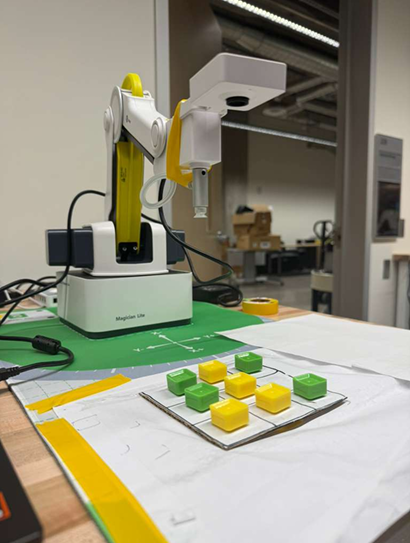

# AI-Powered Robotic Tic-Tac-Toe



**Name:** Harish Anand  
**Institution:** Ira A. Fulton Schools of Engineering, Arizona State University, Tempe, USA

---

## Abstract

This work describes a fully autonomous robotic system designed to play tic-tac-toe with human players through a combination of visual sensing, strategic planning, and physical manipulation. The system leverages a DOBOT Magician robotic manipulator coordinated with OpenCV vision algorithms for grid recognition, HSV-based color tracking for game piece identification, and a Minimax search strategy enhanced with alpha-beta pruning for decision-making.

Testing demonstrates strong performance with reliable grid identification and strategic gameplay that remains **undefeated** — outcomes were either robot victories (85%) or draws (15%).

---

## System Architecture

The implementation divides into three interconnected modules:

1. **Vision System** — continuously observes the playing surface and identifies game state changes
2. **AI Component** — analyzes the current position and selects optimal responses using Minimax
3. **Motion Control** — executes physical moves through carefully choreographed arm trajectories

---

## I. Hardware Setup

| Component | Details |
|-----------|---------|
| Robot | DOBOT Magician with vacuum gripper |
| Camera | External USB webcam (640×480 @ 30fps) |
| Game pieces | 25mm wooden cubes — green (40-80° hue) and yellow (20-30° hue) |
| Playing surface | Hand-drawn 3×3 grid on white A4 paper |
| Communication | Serial interface (COM10, 115200 baud) |
| Speed | 150 mm/s with ±0.2 mm repeatability |

---

## II. Software Stack

- **Python 3** — main control software
- **PyDOBOT** — serial communication with the robotic arm
- **OpenCV** — image processing and computer vision
- **NumPy** — numerical computation and array handling

---

## III. Vision Processing

### Grid Recognition
Three complementary detection methods for maximum reliability:

1. **Global Thresholding** — Gaussian blur + fixed threshold at mid-intensity (127)
2. **Local Adaptive Processing** — accounts for uneven lighting within 15-pixel neighborhoods
3. **Edge Extraction** — Canny edge detection with tuned thresholds (40 and 120)

Valid grids must meet geometric criteria:
- Area: `2000 < A < 0.9 × W × H`
- Aspect ratio: `0.6 < width/height < 1.5`

### Game Piece Identification
- Cells classified as occupied when colored pixels exceed 15% of cell area
- HSV color space used for lighting-robust detection
- Morphological closing with 5×5 kernel reduces noise

---

## IV. AI — Minimax with Alpha-Beta Pruning

### Game State Encoding
- `0` = empty square
- `1` = human move (X)
- `2` = robot move (O)

### Scoring Function
```
Score = 10 - depth   (robot wins)
Score = depth - 10   (human wins)
Score = 0            (draw)
```

Alpha-beta pruning eliminates branches that cannot affect the final decision, significantly improving efficiency.

---

## V. Motion Control

### Movement Sequence (per piece placement)
1. Return to safe observation position
2. Navigate above pickup location (Z=80mm clearance)
3. Lower to contact height (Z=-46.5mm)
4. Engage vacuum — wait 1.2s for secure grip
5. Raise to safe clearance height
6. Move above target grid position
7. Descend to placement height
8. Release vacuum — wait 1.2s
9. Ascend and return to observation position

### Error Handling (Gestural Feedback)
- Invalid placements → robot shakes "head" (±40mm sweep, 4 rapid movements)
- Piece tampering → warning gesture triggered
- Turn violations → move prevented

---

## VI. Performance Results

| Metric | Result |
|--------|--------|
| Grid detection accuracy | 98.5% |
| Piece recognition accuracy | 96.2% |
| False positive rate | 1.8% |
| Placement accuracy | < 2mm |
| Average move time | 12–15 seconds |
| Average game duration | 3.5 minutes |
| Overall system reliability | 99.2% |
| Win rate | 85% wins, 15% draws, 0% losses |

---

## VII. Challenges & Solutions

| Challenge | Solution |
|-----------|----------|
| Inconsistent grid detection under varying lighting | Three complementary detection methods |
| Coordinate drift across positions | Manual calibration of each grid position at Z=-46.5mm |
| False detections from hand shadows | 5-frame consistency check + 3.5s temporal filter |
| Block placement errors | Standardized Z-heights + 1.2s vacuum dwell time |

---

## VIII. Conclusion

This project successfully integrated visual perception, strategic reasoning, and physical control into a functional interactive system. Primary achievements:

- Robust multi-method grid detection with geometric correction
- Color-based piece detection resilient to positioning variations
- Unbeatable Minimax strategy (0 losses across all test games)
- Millimeter-level placement accuracy
- Intelligent error detection with gestural feedback

---

## Source Code

- Source code available in this repository: `TICTACTOEMIDTERM.py`

---

## References

1. S. Russell and P. Norvig, *Artificial Intelligence: A Modern Approach*, 4th ed. Pearson, 2020.
2. G. Bradski and A. Kaehler, *Learning OpenCV*, O'Reilly Media, 2008.

## Demo Image


